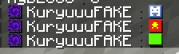

# SpritesChat (Paper & Folia 1.21.6 - 1.21.11+)

<p align="center">
  
</p>

<p align="center">
  <b>Plugin Chat Icon Sprites, Player Heads, TAB & Scoreboard 100% Thuần Plugin</b><br>
  <i>(Hoàn Toàn Không Cần Bất Kỳ Resource Pack Nào)</i><br>
  Tương thích hoàn hảo với <b>Paper</b>, <b>Folia</b>, <b>Canvas 1.21.6 - 1.21.11+</b>, <b>Geyser (Bedrock)</b> & <b>ViaVersion</b>.
</p>

---

## 🚀 Đột Phá: Native ObjectComponent (Minecraft 1.21.6+)

Từ phiên bản **Minecraft 1.21.6+** (Paper / Folia / Canvas 1.21.6 - 1.21.11+), Mojang và Kyori Adventure đã chính thức hỗ trợ công nghệ **`ObjectComponent`**:
- **`SpriteObjectContents` (`ObjectContents.sprite(Key sprite)`)**: Cho phép Minecraft Client tự render trực tiếp texture sprite vật phẩm/khối (ví dụ `minecraft:item/end_crystal`, `minecraft:item/diamond`) **hoàn toàn từ client gốc của game**, người chơi vào server là thấy ngay mà **không cần cài thêm resource pack hay mod nào**!
- **`PlayerHeadObjectContents` (`ObjectContents.playerHead()`)**: Cho phép render trực tiếp Player Head kèm texture Base64 (cờ các quốc gia, logo mạng xã hội, skin người chơi) ngay trong khung chat, tablist và scoreboard!

Plugin **SpritesChat** tận dụng tối đa tính năng này, mang lại trải nghiệm chat sinh động và tối ưu 0 độ trễ.

---

## 🌟 Tính Năng Nổi Bật

### 1. 💬 Chat Icon Sprites NATIVE (Ví dụ `:end_crystal:`, `:diamond:`)
- Người chơi chỉ cần gõ `:tên_vật_phẩm:` (ví dụ `:diamond:`, `:netherite_sword:`, `:totem:`, `:crystal:`...).
- Hỗ trợ toàn bộ items và blocks của Minecraft Vanilla.
- Hỗ trợ tên viết tắt thuận tiện: `:pearl:` (Ender Pearl), `:crystal:` (End Crystal), `:totem:` (Totem of Undying), `:gap:` (Golden Apple), `:egap:` (Enchanted Golden Apple), `:dia:` (Diamond), `:sword:` (Netherite Sword), `:dc:` (Discord), v.v.
- Kèm theo tooltip hover (tên tiếng Việt) và click để tự động chèn lệnh.

### 2. 👤 Player Heads NATIVE & Cờ Quốc Gia (Ví dụ `:VietNam:`, `:discord:`)
- Render đầu cờ Việt Nam, cờ các nước, logo Discord, YouTube, Facebook, Trái Đất... với texture sắc nét.
- **Lấy skin người chơi đa tầng (Multi-tier Skin Resolution)**:
  - Người chơi đang online trong server.
  - Skin tùy chỉnh qua **SkinsRestorer hook**.
  - **Tự động tải Mojang Skin của tài khoản Premium ngoài server** (ví dụ `:Notch:`, `:Dream:`, `:MumboJumbo:`, v.v.) qua Cloudflare CDN & Mojang Session API.
  - Fallback an toàn cho tài khoản crack theo thuật toán UUID v3 MD5 + Steve/Alex.
  - Bộ nhớ đệm persistent trên ổ đĩa (`cache/skins/<name>.json`) đảm bảo 0 độ trễ (0ms latency).

### 3. 📋 Hỗ Trợ Đưa Icon Vào TAB, Scoreboard & Rank LuckPerms
Tích hợp sâu với plugin [TAB (NEZNAMY)](https://github.com/NEZNAMY/TAB) và [LuckPerms](https://luckperms.net/):
- Tự động chuyển đổi icon trong rank prefix/suffix sang định dạng thẻ TAB (`<sprite:...>` hoặc `<head_texture:...>`).
- Cung cấp bộ **PlaceholderAPI Expansion** đầy đủ:
  - `%spriteschat_prefix%` / `%spriteschat_suffix%`: Lấy rank prefix/suffix từ LuckPerms đã parse sang mã TAB.
  - `%spriteschat_parse_<text>%`: Chuyển đổi bất kỳ văn bản/placeholder nào có chứa icon `:token:` sang định dạng TAB.
  - `%spriteschat_<token>%`: Lấy trực tiếp mã hiển thị icon (ví dụ `%spriteschat_diamond%`, `%spriteschat_vn%`, `%spriteschat_discord%`).
  - `%spriteschat_sprite_<token>%`: Lấy riêng mã Atlas Sprite phục vụ cho Scoreboard sidebar (nơi client không hỗ trợ skull).
  - `%spriteschat_player%` / `%spriteschat_head_<tên>%`: Lấy thẻ head của người chơi.

### 4. 💡 Gợi Ý Chat Thông Minh (Tab Complete Autocomplete)
- Khi người chơi gõ dấu `:` trong chat, hệ thống sẽ tự động hiển thị danh sách gợi ý emote tương ứng kèm tooltip giải thích tiếng Việt.

### 5. 📱 Tương Thích Tuyệt Đối Cho Bedrock (Geyser/Floodgate) & Java Cũ (< 1.21.6)
- **Per-Viewer Chat Pipeline**: Tự động nhận diện phiên bản client của từng người xem (viewer):
  - **Java $\ge$ 1.21.6 (Protocol $\ge$ 771)**: Nhận 100% Native `ObjectComponent` trực quan.
  - **Bedrock Edition (Geyser / Floodgate)** và **Java < 1.21.6 (ViaVersion)**: Tự động chuyển đổi sang định dạng văn bản sạch `:item:` (ví dụ `:diamond:`, `:vn:`, `:Notch:`) kèm tooltip hover, tránh lỗi vỡ font hoặc chuỗi thô `[item/diamond@items]`.
  - **Console / Server Logs**: Hiển thị text sạch, không làm bẩn file log của server.

### 6. ⚡ 100% Folia, Canvas & PlugMan Compatible
- Thiết kế non-blocking, hoàn toàn thread-safe trên máy chủ đa luồng **Folia** và **Canvas 1.21.11**.
- Chống hiện tượng các plugin chat format (LPC, EssentialsChat, Canvas) làm phẳng (flatten) ObjectComponent thành text thô.
- Hỗ trợ **PlugManX** (`/plugman reload SpritesChat`) mượt mà không xảy ra lỗi classloader hay rò rỉ listener.

---

## 📦 Cài Đặt

1. Tải file `SpritesChat-1.0.0.jar` mới nhất.
2. Thả vào thư mục `plugins/` của máy chủ Paper / Folia / Canvas 1.21.6+.
3. (Tùy chọn) Cài đặt thêm:
   - **PlaceholderAPI** (để dùng các placeholder cho TAB / Scoreboard).
   - **TAB** (để đưa icon vào Tablist, Nametag và Scoreboard).
   - **LuckPerms** (để đưa icon vào rank prefix/suffix).
   - **SkinsRestorer** (để đồng bộ skin tùy chỉnh của người chơi).
   - **Geyser / Floodgate** & **ViaVersion** (để hỗ trợ người chơi Bedrock và Java phiên bản cũ).
4. Khởi động server và tận hưởng!

---

## 🕹️ Lệnh & Quyền Hạn

| Lệnh | Quyền Hạn | Mô Tả |
| :--- | :--- | :--- |
| `/sprites list [trang]` | `spriteschat.use` | Xem danh sách sprites & heads kèm xem trước trực quan |
| `/sprites reload` | `spriteschat.admin` | Tải lại cấu hình plugin |
| `/sprites head <tên> [category]` | `spriteschat.admin` | Tải và thêm một head mới từ Mojang hoặc minecraft-heads.com |

### Permission Nodes:
- `spriteschat.use`: Cho phép sử dụng các icon sprite cơ bản và material trong chat (Mặc định: `true`).
- `spriteschat.use.heads`: Cho phép sử dụng các icon player heads (Mặc định: `true`).
- `spriteschat.use.players`: Cho phép gõ head của người chơi theo tên dạng `:name:` (Mặc định: `true`).
- `spriteschat.admin`: Quyền quản trị plugin (Mặc định: `OP`).

---

## ⚙️ Cấu Hình Mẫu (`config.yml`)

```yaml
# Cài đặt hiển thị Player Head theo tên người chơi (:nameplayer:)
player-heads:
  enabled: true
  mode: "ALL" # ALL: Mọi người chơi (online + premium ngoài server + crack)
  permission: "spriteschat.use.players"

# Cài đặt tích hợp với TAB và Scoreboard
tab-integration:
  # Định dạng head: HEAD_TEXTURE, HEAD_NAME, HEAD_UUID, SPRITE_FALLBACK
  head-format: "HEAD_TEXTURE"
  fallback-to-sprite-if-available: true

# Gợi ý Chat khi gõ dấu ':'
chat-suggestions:
  enabled: true
  tab-complete: true
  max-completions: 30

# Chế độ tương thích cho Bedrock (Geyser) & Java cũ (< 1.21.6)
legacy-compatibility:
  enabled: true
  format: ":{item}:" # Định dạng hiển thị cho client cũ
  min-protocol-version: 771 # 1.21.6 protocol version
  apply-to-placeholders: true
```

---

## 🔨 Build Từ Mã Nguồn

Yêu cầu JDK 21+ và Maven:
```bash
git clone https://github.com/kuryhuynh/Sprites-Chat-Tab-Scoreboard-1.21.6-.git
cd Sprites-Chat-Tab-Scoreboard-1.21.6-
mvn clean package
```
File jar sau khi build sẽ nằm tại `target/SpritesChat-1.0.0.jar`.

---

## 📄 Bản Quyền & Tác Giả

- **Tác giả**: [Kury](https://github.com/kuryhuynh)
- **Mã nguồn**: [GitHub Repository](https://github.com/kuryhuynh/Sprites-Chat-Tab-Scoreboard-1.21.6-)
- Giấy phép: MIT License.
